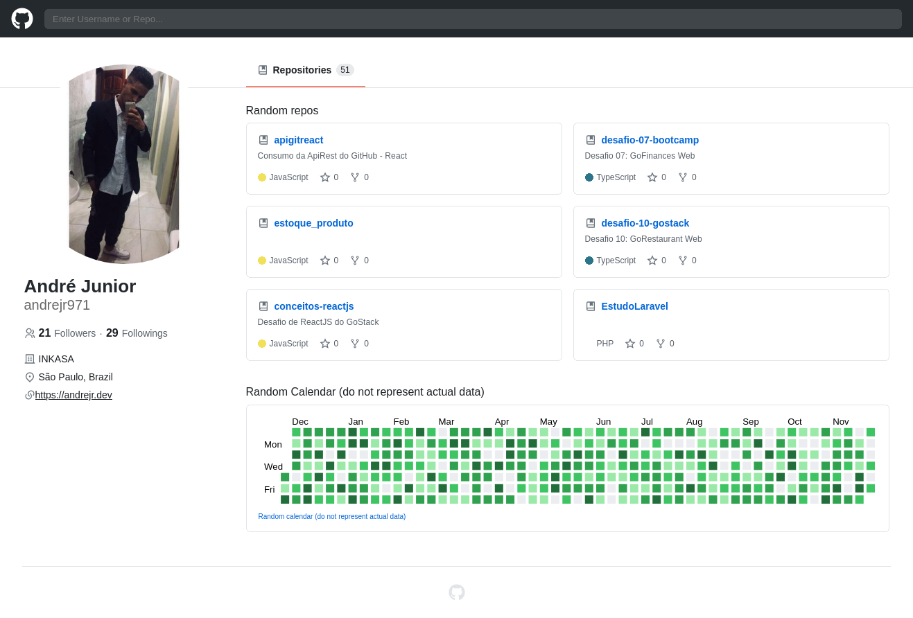
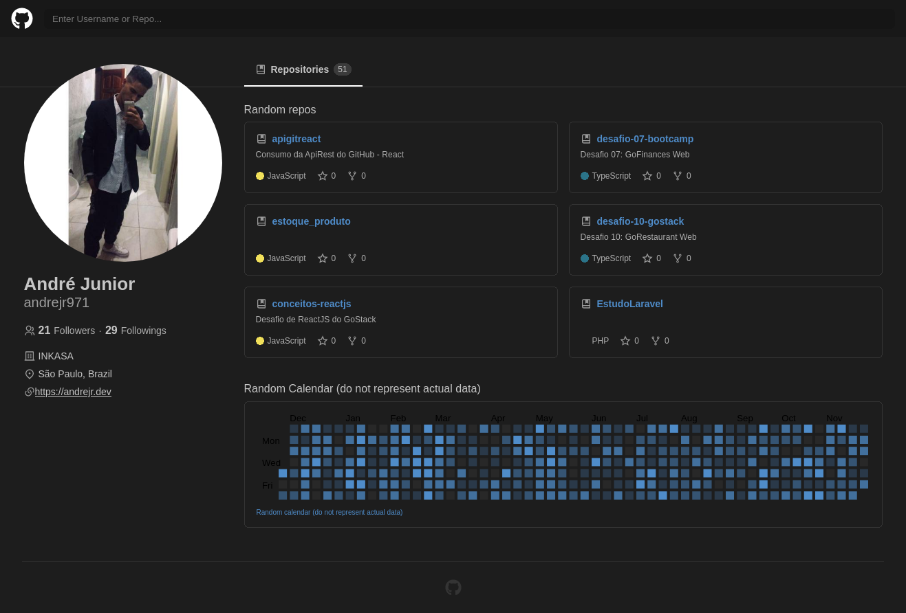

<h1 align="center">
    UI Clone - Github
</h1>

Responsive Github UI Clone (partial) for study purposes.

  <a href="#-tecnologias">Tecnologias</a>&nbsp;&nbsp;&nbsp;|&nbsp;&nbsp;&nbsp;
  <a href="#-projeto">Projeto</a>&nbsp;&nbsp;&nbsp;

 

  

  

## 🚀 Tecnologias

Esse projeto foi desenvolvido com as seguintes tecnologias:

- [React](https://reactjs.org)
- [StyledComponents](https://styled-components.com)
- [Typescript](https://www.typescriptlang.org/)
- [React Training / React Router](https://reactrouter.com/)

## 💻 Projeto

Clone da interface do GitHub

---

Feito by André Junior :wave: [portifólio](https://andrejr.dev)